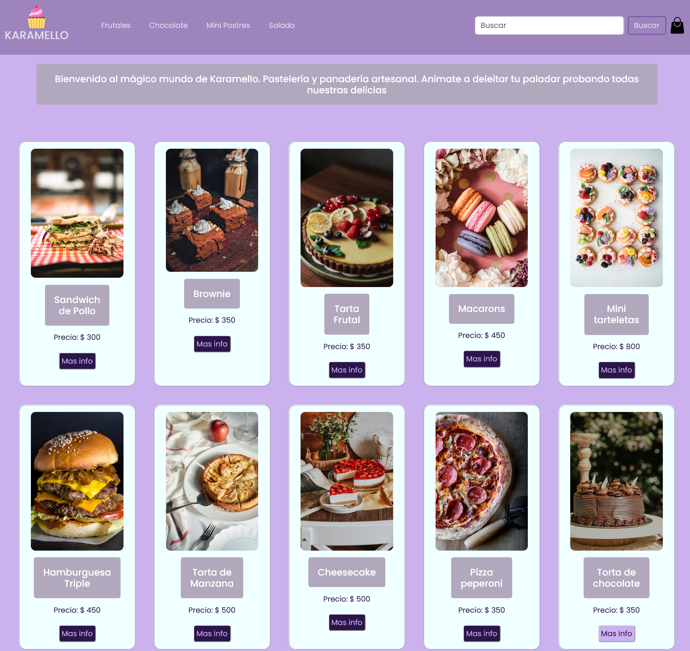

# ecommerce - Karamello - React JS 

##### `Desarrollado por Marina Rogova`

## Descripción

Se trata de un proyecto desarrollado para el curso de React JS de Coderhouse. 

Es un ecommerce de una panadería y pastelerí artesanal. Permite filtrar los productos por categorías, asi como ver el detalle de cada producto al clicker sobre ellos. 

Luego de agregar los productos al carrito, se accede al carrito y se visualiza una vista resumida de los productos añadidos mas el precio final. Para finalizar la compra, se ingresan los datos del usuario y se envia el formulario a Firebase con los detalles de la compra y datos del comprador.

## Vista Previa

## Dependencias

`react-router-dom` `firebase` `toastify`

